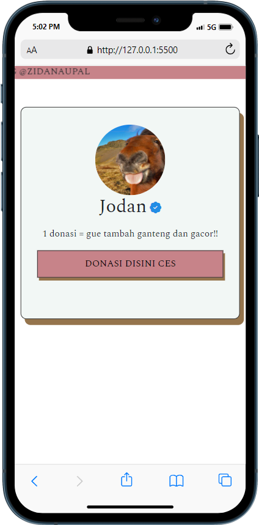

<h1 align="center">Hi 👋, I'm Zidan Naufal</h1>
<h3 align="center">A Information System, Web Developer, E-Commerce Developer, Web Designer</h3>

  

  

- 🔭 I’m currently studying on **SMA DIPONEGORO 1 JAKARTA**

- 👯 I’m looking to collaborate on **Software, and Website Developer**

- 👨‍💻 All of my projects are available at [https://zidanaufal-me.vercel.app/](https://zidanaufal-me.vercel.app/)

- 💬 Ask me about **Payment Getaway, Google API, Google login System, Javascript, Bootstrap,**

- 📫 How to reach me **mzidanaufal.07@gmail.com**

- ⚡ Fun fact **i love latte**

<h3 align="left">Connect with me:</h3>

<h3 align="left">Languages and Tools:</h3>

                   

&nbsp;

<h1 style="margin-bottom: 20px;">MY CURRENT PROJECT</h1>
<h3>SCREEN DISPLAY ORDER MENU</h3>
<a href="https://github.com/zdnpl/marketplace-dejava">https://github.com/zdnpl/marketplace-dejava</a>
</img>
<h3>SAWERIA</h3>
<h4>lookin for saweria? i made one</h4>
<a href="https://zdnpl.github.io/angpao/">https://zdnpl.github.io/angpao/</a>
</img>

